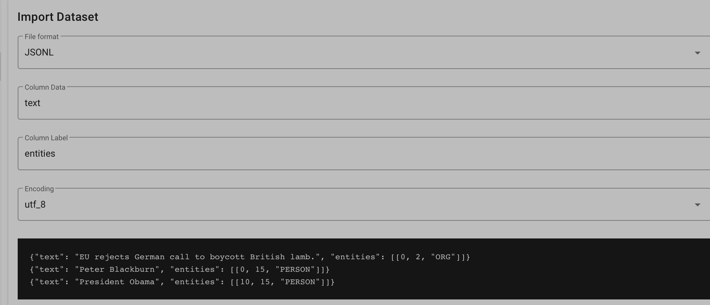

[](https://classroom.github.com/a/VvK55uzC)
[](https://classroom.github.com/open-in-codespaces?assignment_repo_id=21297585)
# mt-lab-session-ner-starter

## Grupo
1. VICTOR MIGUEL DE SOUZA SOARES - victor.miguel@ufrpe.br
2. GUSTAVO HENRIQUE - EMAIL
3. NOME INTEGRANTE - EMAIL

## Prerequisites:
* Docker
* Python

## Overview
1. Considere o cenário de uma plataforma de e-commerce, no fluxo de cadastrar novos produtos.
2. Seu objetivo é construir um sistema para auxiliar a extração de informações de um produto, a partir do título dele. Assim, as informações de catálogo/cadastro do produto podem ser preenchidas automaticamente.
3. Por exemplo, quando o usuário digitar "iphone 14 128gb vermelho", o sistema já deve identificar e sugerir automaticamente a categoria (SMARTPHONES), o modelo (IPHONE 14), a memória (128GB) e a cor (VERMELHO).

## Descrição da atividade
1. Cada grupo deve escolher uma base de dados na pasta `data/raw/` e escolher uma base de dados (diferente de `beauty.ibyte.jsonl` e `toys_and_babies.ibyte`)
2. O grupo deve realizar o processo de definição das TAGs (entidades nomeadas), anotação, treinamento e seleção da melhor abordagem de NER para resolver esse problema (ver seção [Running Doccano](#running-doccano)). O grupo pode usar outras alternativas para anotação das entidades (datasets externos, zero-shot learning, etc).
4. As anotações devem ser salvas na pasta `data/annotations/nome_do_dataset.jsonl`, no mesmo formato dos arquivos de exemplo `beauty.ibyte.jsonl` e `toys_and_babies.ibyte`, e.g.:
```
{"text": "Pelucia Bonnie Bear 30Cm Azul Multikids   BR166", "entities": [[0, 7, "TIPO"], [8, 19, "PRODUTO"], [30, 39, "MARCA"]]}
```
5. Os notebooks para treinamento e avaliação devem estar salvos de forma ORGANIZADA na pasta `notebooks`
6. No dia agendado para a apresentação, o grupo deve mostrar em sala como foi o processo de solução do problema, e os resultados obtidos (no máximo 5 - 10 min por grupo).

## Avaliação:
Os critérios para a avaliação serão:
- Anotações das entidades no formato adequado
- Organização e metodologia experimental
- Apresentação dos resultados

# Running Doccano
## Run as docker container
```
chmod +x scripts/start-doccano.sh
./scripts/0.setup-doccano.sh
./scripts/1.start-doccano.sh
```

## Import annotations
1. Access doccano at the URL localhost:8000
2. Login 
3. Go to "Dataset" --> "Actions" --> Import Dataset
4. Change the File Format to JSONL
5. Set column label to be "entities"



6. See the annotations at "Start Annotation"
